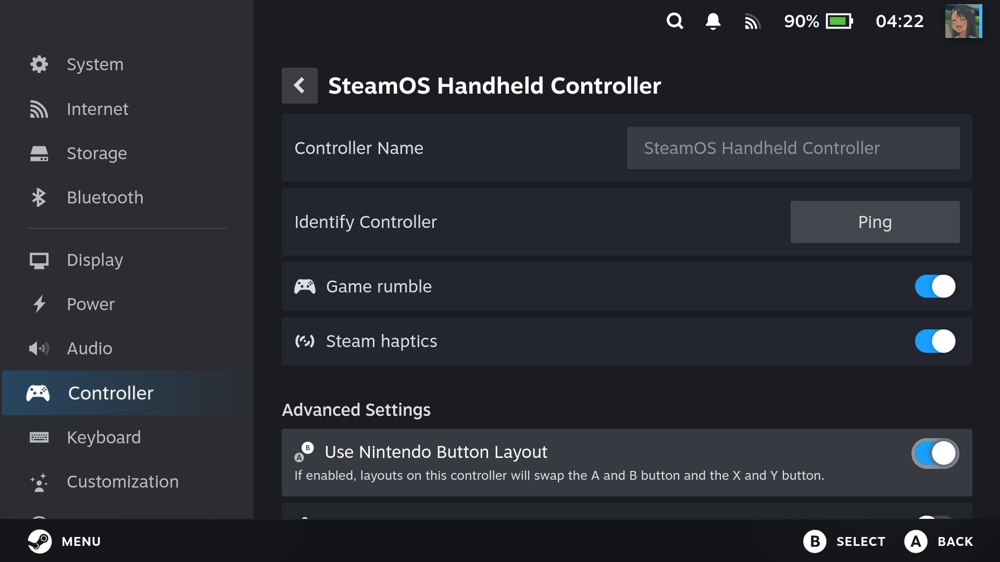
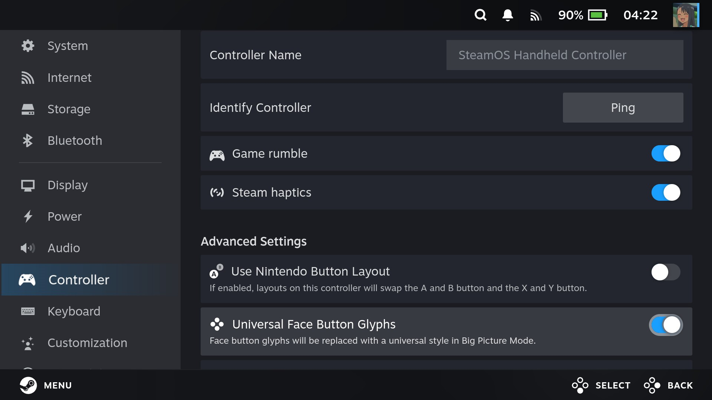
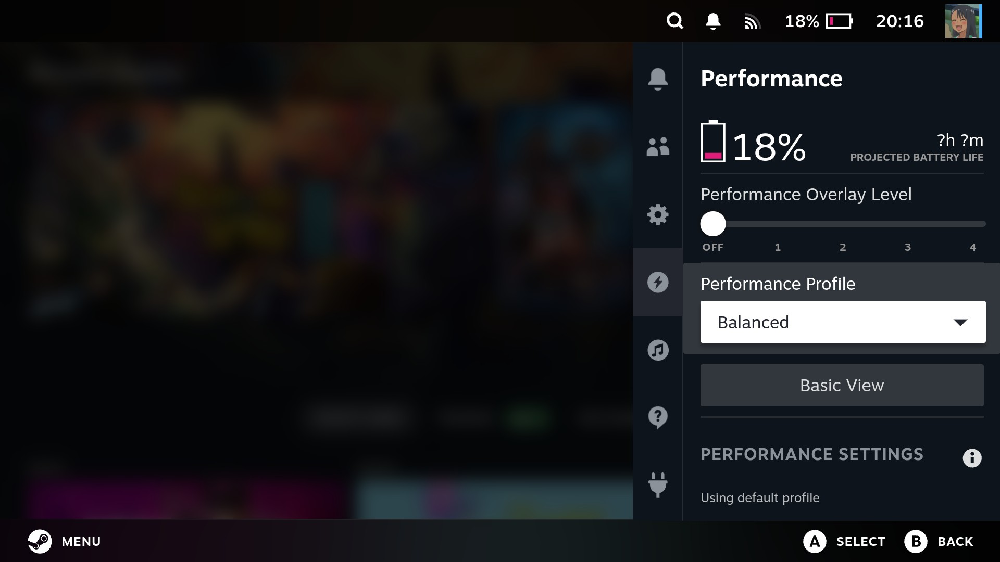

# Frequently Asked Questions

## Controls

### My device has a Nintendo button layout. How do I make Steam match it?

Open **Settings > Controller**, then enable **Use Nintendo Button Layout**. Steam
will swap the A/B and X/Y buttons to match a Nintendo-style layout.

### The input prompts in Steam do not match my device. How do I fix them?

Steam cannot change its ABXY prompts to match every physical button layout.
Instead, it can replace them with universal glyphs that show which of the four
face buttons to press.

Open **Settings > Controller**, then enable **Universal Face Button Glyphs**.

## Armada Control

### Power profiles are not applying in Armada Control. How do I fix this?

The **Power** tab in Armada Control only changes how the power profiles behave;
it does not activate a profile. To switch profiles, open Steam's Quick Access
Menu, select the **Performance** tab, and choose a **Performance Profile**.

