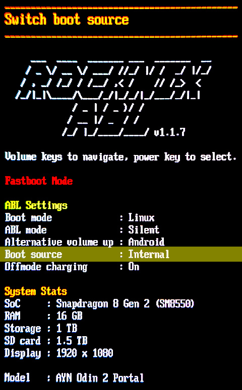

Once Armada is running from the SD card, you can install it to the device's
internal storage so it boots without the card.

## Installation

Open **Desktop Mode** and launch **Armada Installer** from the **System** menu.

The installer checks what is already on the internal storage and offers:

- **Install alongside Android** (fresh device): choose how much storage Android
  keeps; Armada takes the rest. This **factory-resets Android** (you lose Android
  apps and data, but the Android system itself stays).
- **Reinstall / Switch to Armada** (a ROCKNIX or Armada install is already
  present): Armada replaces the existing Linux install and **leaves Android
  untouched**, with no resize or wipe.
- **Remove and restore Android**: erase the Armada/ROCKNIX install and give the
  whole disk back to Android (Android factory-resets on its next boot).

When it finishes, **power off and remove the SD card.**

## Check Boot Source

To ensure your device boots from internal storage, enter the ROCKNIX ABL by holding **VOL-** as the device powers on.

Once in the ABL, look for the **Boot source** option and make sure it is set to **Internal**.

{ width="300" }

If it says anything other than **Internal**, use **VOL-** and **VOL+** until the **Switch boot source** option is selected, then press the **POWER** button to toggle the boot source.

## Recovering a Failed Installation

If an installation is interrupted, rerun Armada Installer from the SD card to finish it.

If the device will not boot the internal installation, enter the ROCKNIX ABL and change the **Boot source** to **SDCard** to attempt the installation from the SD card.

If you want to restore the full Android user data partition, see [Uninstalling and Restoring Android](./uninstalling-and-restoring-android.md).
