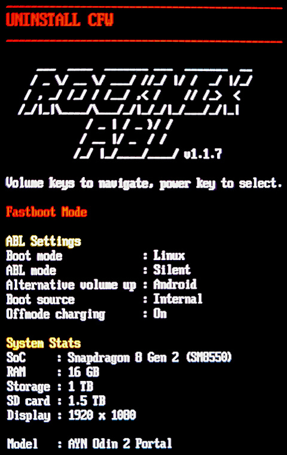
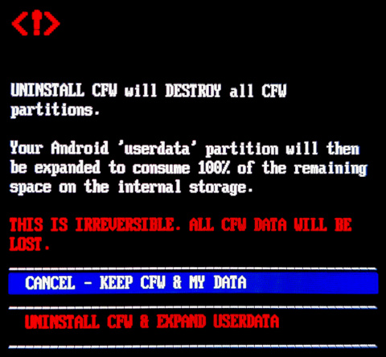
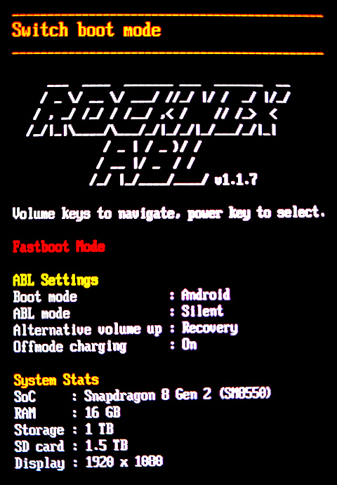

## Overview

To remove or reinstall an internal install, you can use the ROCKNIX ABL.

## Uninstall Armada

1. **Enter the bootloader.** Power off, then hold **VOL-** while powering on to enter the bootloader.

2. **Select Uninstall Option.** Use **VOL-** or **VOL+** to change options until **UNINSTALL CFW** is selected, then press the **POWER** button to bring up the uninstall confirmation screen.

    { width="300" }

3. **Confirm CFW Uninstall.** Use **VOL-** or **VOL+** to change the option to **UNINSTALL CFW & EXPAND USERDATA**, then press the **POWER** button to start the process.

    { width="300" }

## Change Boot Mode

To switch the boot mode back to Android, you can use the ROCKNIX ABL.

1. **Enter the bootloader.** Power off, then hold **VOL-** while powering on to enter the bootloader.

2. **Switch Boot Mode.** Use **VOL-** or **VOL+** to change options until **Switch boot mode** is selected, then press the **POWER** button to change options until the **Boot mode** says **Android**.

    { width="300" }
