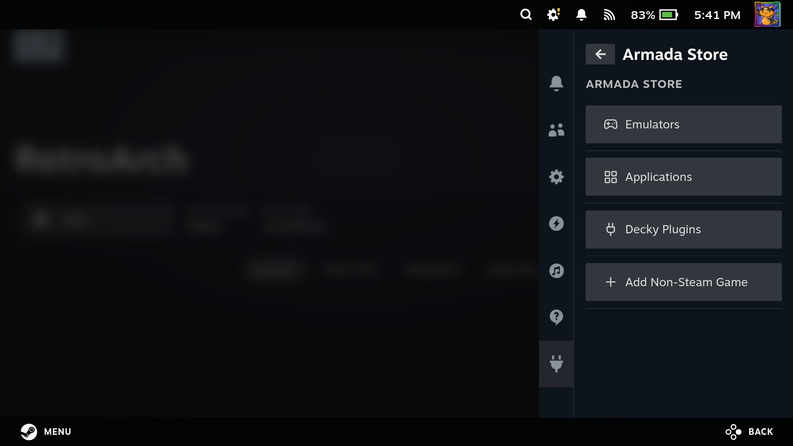
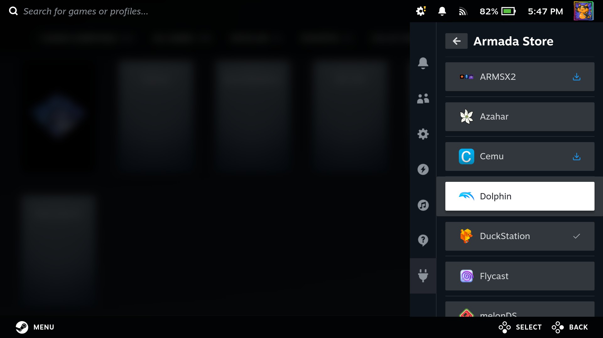

Armada Store is a pre-installed Decky plugin that provides a simple way to install common applications, emulators, and utilities.

Open the Quick Access Menu and select the Decky tab, then open **Armada Store**.

## Categories

There are three categories:

- **Emulators** - Supported emulators in Armada and ES-DE
- **Applications** - Gaming frontends, streaming apps, and other useful system utilties
- **Decky Plugins** - Supported Decky Loader plugins

## Status

If an entry has been installed, it will have one of the following statuses:

| Status Icon | Description |
| --- | --- |
|  | Entry has been installed. If this is an application, a non-Steam shortcut was created. |
|  | Entry has an update available. |
